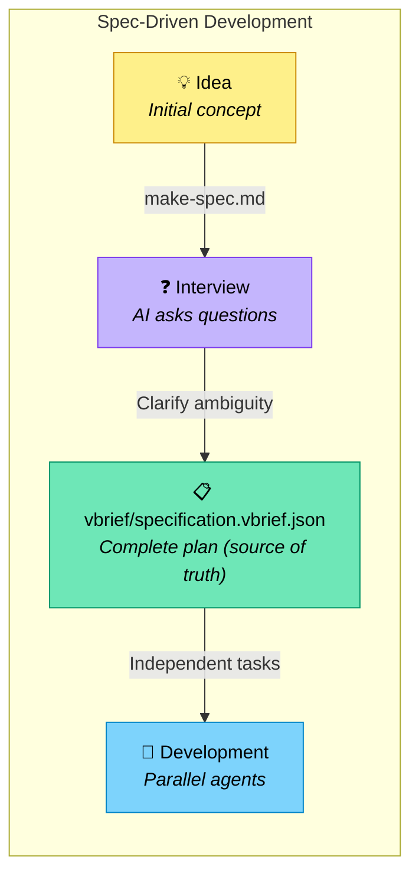
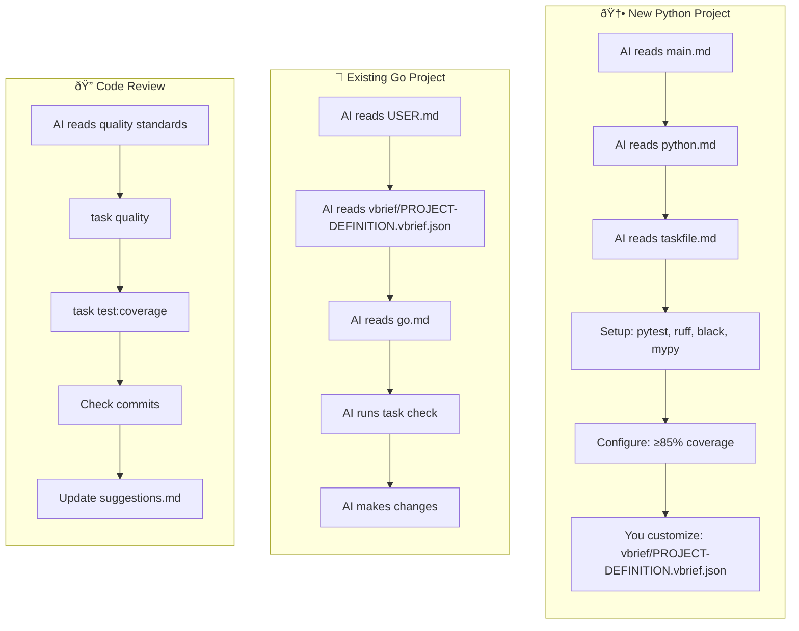
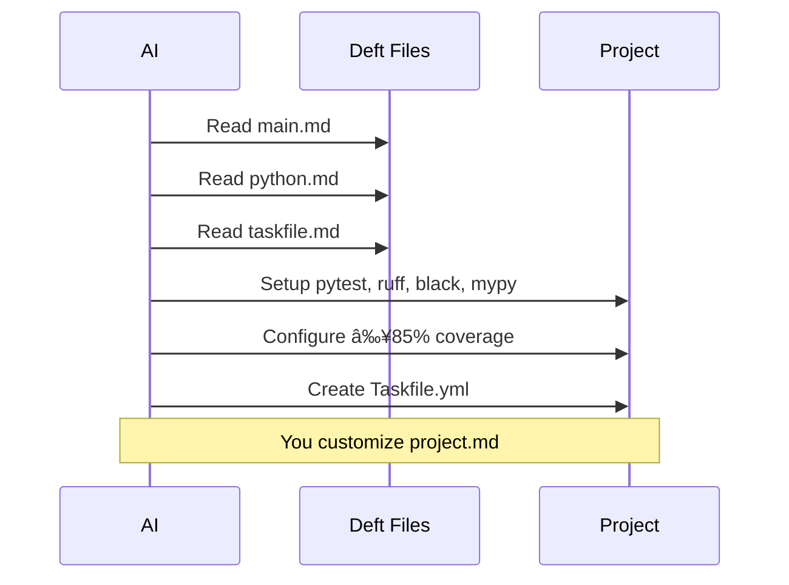
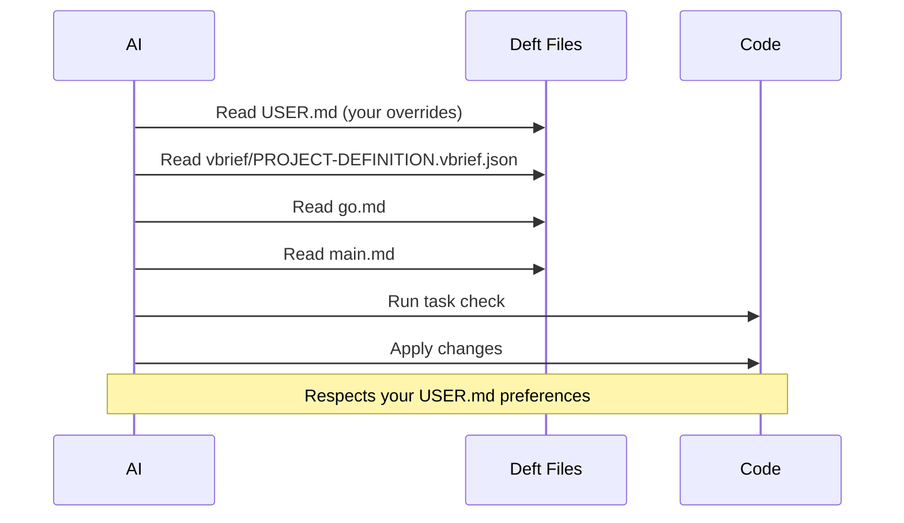
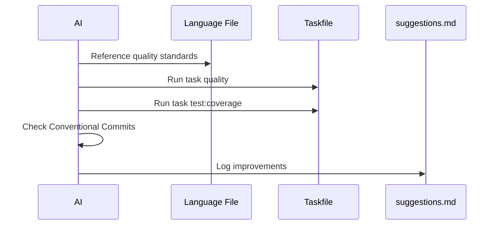

 Deft

**One-shot, anti-slop**

*A layered framework for AI-assisted development with consistent standards and workflows.*

## TL;DR

Deft is a SKILL.md that makes AI coding significantly more effective by providing consistent, hierarchical standards. Instead of repeating the same instructions in every AI session, you define your preferences once—from general coding style to project-specific rules—and AI agents follow them. The result: higher quality code, reproducible workflows, and AI that gets better over time by learning from your patterns.

**Key benefits:** No more "AI forgot my preferences", no more inconsistent code style across AI sessions, no more re-explaining your stack every time.

**Don't have preferences yet?** No problem—Deft ships with professional-grade defaults for Python, Go, TypeScript, C++, and common workflows. Use it out of the box and customize later.

**Platform compatibility:** If you're on a platform that doesn't yet support SKILL.md, just add a line to your `AGENTS.md` that says "See deft/main.md".

**Context-efficient:** Deft keeps AI context windows lean through RFC 2119-based notation (!, ~, ≉, ⊗) and lazy-loading—AI only reads the files relevant to the current task, not everything at once.

**📍 Roadmap:** See [ROADMAP.md](./ROADMAP.md) for the development timeline, open issues, and planned work.

> **📢 Cloned manually?** Tell your agent: "Read `deft/QUICK-START.md` and follow it." It creates your project's AGENTS.md and starts the setup flow automatically.

> **🔄 Upgrading from a previous version?** Read [UPGRADING.md](./UPGRADING.md) before proceeding.  
> **Agents:** ! Read [UPGRADING.md](./UPGRADING.md) on the first session after a framework update.

> **â¬‡ï¸ Get Deft:** Download the installer for your platform from [GitHub Releases](https://github.com/deftai/directive/releases), run it, and follow the prompts. See [Getting Started](#-getting-started) below.

## 🚀 Getting Started

Download the installer for your platform from [GitHub Releases](https://github.com/deftai/directive/releases), run it, and follow the prompts.

> **⬇️ Quick Download** -- direct binaries from the [latest GitHub Release](https://github.com/deftai/directive/releases/latest):
> - **Windows:** [`install-windows-amd64.exe`](https://github.com/deftai/directive/releases/latest/download/install-windows-amd64.exe) | [`install-windows-arm64.exe`](https://github.com/deftai/directive/releases/latest/download/install-windows-arm64.exe) (Surface / Copilot+ PCs)
> - **macOS:** [`install-macos-universal`](https://github.com/deftai/directive/releases/latest/download/install-macos-universal) (Intel + Apple Silicon)
> - **Linux:** [`install-linux-amd64`](https://github.com/deftai/directive/releases/latest/download/install-linux-amd64) | [`install-linux-arm64`](https://github.com/deftai/directive/releases/latest/download/install-linux-arm64) (Raspberry Pi / ARM)

### 1. Install Deft

**Windows:**
- Download `install-windows-amd64.exe` (or `install-windows-arm64.exe` for Surface / Copilot+ PCs)
- Run the downloaded file -- Windows SmartScreen may warn about an unrecognised publisher; click "More info" then "Run anyway" (code signing is planned for a future release)

**macOS:**
- Download `install-macos-universal` -- works on all Macs (Intel and Apple Silicon)
- Make it executable and run:
  ```bash
  chmod +x install-macos-universal && ./install-macos-universal
  ```
- If macOS Gatekeeper blocks the file: right-click then Open, or remove the quarantine attribute first (code signing is planned for a future release):
  ```bash
  xattr -d com.apple.quarantine install-macos-universal
  ```

**Linux:**
- Download `install-linux-amd64` (or `install-linux-arm64` for Raspberry Pi / ARM cloud)
- Make it executable and run:
  ```bash
  chmod +x install-linux-amd64 && ./install-linux-amd64
  ```

The installer guides you through choosing a project directory, installs git if needed, clones deft, wires it into `AGENTS.md`, and creates your user config directory.

**Manual clone (no installer):** If you clone deft directly via `git clone`, tell your agent: "Read `deft/QUICK-START.md` and follow it." It creates your project's AGENTS.md and starts the setup flow automatically.

**Building from source (developers only):** requires Go 1.22+

```bash
go run ./cmd/deft-install/
```

### 2. Set Up Your Preferences

Deft offers two setup paths that produce the same output (`USER.md` + `vbrief/PROJECT-DEFINITION.vbrief.json`) but adapt to different users:

**Agent-driven** (recommended for most users) — Tell your agent `read AGENTS.md and follow it` to start the Deft setup flow. The agent will ask how technical you are and adapt accordingly:
- *Technical*: asks about languages, strategy, coverage, meta rules, and custom rules
- *Some opinions*: asks name, languages, and custom rules; defaults the rest
- *Just pick defaults*: asks what you're building, infers everything else

**CLI** (for technical users) — If you're running commands in a terminal, you're technical. The CLI treats you as a power user and asks all configuration questions directly — no skill-level gate.

```bash
deft/run bootstrap       # Interactive setup for USER.md and PROJECT-DEFINITION.vbrief.json
```

**User config location:**
- Unix / macOS: `~/.config/deft/USER.md`
- Windows: `%APPDATA%\deft\USER.md`
- Override: set `DEFT_USER_PATH` environment variable

### 3. Generate a Scope vBRIEF

`deft/run bootstrap` can chain into the scope-vBRIEF interview, or create one anytime:

```bash
deft/run spec            # AI-assisted interview -> vbrief/proposed/YYYY-MM-DD-<slug>.vbrief.json
```

The interview writes a **scope vBRIEF** to `vbrief/proposed/` as `YYYY-MM-DD-<slug>.vbrief.json`. `vbrief/*.vbrief.json` files are the source of truth; `.md` files (`PRD.md`, `SPECIFICATION.md`, `ROADMAP.md`) are rendered views generated on demand via `task *:render`. Direct edits to the rendered `.md` files are overwritten on the next render -- edit the underlying `.vbrief.json` instead.

Other commands:

```bash
deft/run reset           # Reset config files
deft/run validate        # Check deft configuration
deft/run doctor          # Check system dependencies
deft/run upgrade         # Record the current framework version after updating deft
```

### 4. Build With AI

Ask your AI to build the product/project from your scope vBRIEFs and away you go:

```
Read vbrief/PROJECT-DEFINITION.vbrief.json and the scope vBRIEFs in
vbrief/active/ (or vbrief/pending/ if none are active yet) and implement
the project following deft/main.md standards.
```

> **Brownfield adoption:** Adding Deft to an existing project with pre-v0.20 `SPECIFICATION.md` / `PROJECT.md`? See [docs/BROWNFIELD.md](./docs/BROWNFIELD.md) for the migration path (`task migrate:vbrief`) and what to expect.

## 🎸 From Vibe to Virtuoso

**AGENTS.md** is great for vibe-coding—loose guidance, good enough for quick work:

> "Make it clean, I like tests, use TypeScript."

**Deft** is for when you want virtuoso results: precise standards, reproducible workflows, and AI that improves over time.

| Vibe (AGENTS.md) | Virtuoso (Deft) |
|------------------|-----------------|
| All rules in one file | Modular—load only what's relevant |
| Gets bloated across languages/tools | Scales cleanly (python.md stays focused) |
| Same context loaded every session | Lazy-loading saves tokens |
| Preferences mixed with standards | Clear separation (user.md vs language files) |
| No evolution mechanism | Meta files capture learnings automatically |
| Starts fresh each project | Portable across projects |

**When to use which:**
- Your AGENTS.md is under 200 lines and you work in one language? Vibe is fine.
- It's growing unwieldy, you're repeating yourself, or you want consistent quality across projects? Deft pays off.

Same instrument, different mastery.

## ⚙️ Platform Requirements

**GitHub** is the primary supported SCM platform. Skills that interact with issues and PRs (`deft-directive-sync`, `deft-directive-swarm`, `deft-directive-review-cycle`, `deft-directive-refinement`) require the [GitHub CLI (`gh`)](https://cli.github.com/) to be installed and authenticated. Core framework features (setup, build, rendering, validation) work independently of any SCM platform.

The migration script (`task migrate:vbrief`) defaults origin provenance to `github-issue` type. Non-GitHub users should manually adjust `references[].type` in generated vBRIEFs after migration.

## 📦 Document Generation & vBRIEF Tooling

Deft provides deterministic `task` commands for rendering, migrating, and validating documents:

| Command | Description | When to use |
|---------|-------------|-------------|
| `task spec:render` | Regenerate `SPECIFICATION.md` from `specification.vbrief.json` | After editing the spec vBRIEF |
| `task roadmap:render` | Regenerate `ROADMAP.md` from `vbrief/pending/` scope vBRIEFs | After promoting/demoting scopes |
| `task project:render` | Regenerate `PROJECT-DEFINITION.vbrief.json` items registry | After scope lifecycle changes |
| `task migrate:vbrief` | Migrate existing projects to vBRIEF lifecycle folder structure | One-time cutover from pre-v0.20 model |
| `task vbrief:validate` | Validate vBRIEF schema, filenames, folder/status consistency | Pre-commit (runs as part of `task check`) |

See [commands.md](./commands.md) for the full change lifecycle and the [Command Lifecycle: `run` vs `task`](./commands.md#command-lifecycle-run-vs-task) section there for detailed usage.

### Command Lifecycle: `run` vs `task`

Deft uses two complementary command surfaces:

- **`run` commands** (`deft/run bootstrap`, `deft/run spec`, `deft/run validate`) handle **interactive creation** — bootstrapping user/project config, conducting spec interviews, validating configuration. These are the entry points for humans starting new work.
- **`task` commands** (`task spec:render`, `task roadmap:render`, `task migrate:vbrief`, etc.) handle **scripted rendering, migration, and validation** — deterministic operations that transform vBRIEF source files into readable artifacts or enforce structural rules.

This split is intentional: `run` commands are conversational and agent-friendly; `task` commands are deterministic and CI-friendly. For the full document lifecycle, start with `run` to create, then use `task` to render and validate. See [commands.md](./commands.md) for cross-references.

## 🎯 What is Deft?

Deft is a structured approach to working with AI coding assistants that provides:

- **Consistent coding standards** across languages and projects
- **Reproducible workflows** via task-based automation
- **Self-improving guidelines** that evolve with your team
- **Hierarchical rule precedence** from general to project-specific
- **Lazy loading** - only read files relevant to current task (see [REFERENCES.md](./REFERENCES.md))

## 📝 Notation Legend

Deft uses compact notation for requirements:

- **!** = MUST (required, mandatory)
- **~** = SHOULD (recommended, strong preference)
- **≉** = SHOULD NOT (discouraged, avoid unless justified)
- **⊗** = MUST NOT (forbidden, never do this)

This notation appears in technical standard files (python.md, go.md, etc.) for scanability. Based on RFC 2119.

## 📚 The Layers

Deft uses a layered architecture where more specific rules override general ones:

```mermaid
flowchart TD
    subgraph precedence ["Rule Precedence (top = highest)"]
        direction TB
        U["👤 USER.md<br/><i>Personal preferences</i>"]
        P["📁 PROJECT-DEFINITION.vbrief.json<br/><i>Project identity + rules</i>"]
        L["🐍 python.md / go.md / etc.<br/><i>Language standards</i>"]
        T["🔧 taskfile.md<br/><i>Tool guidelines</i>"]
        M["🤖 main.md<br/><i>General AI behavior</i>"]
        S["📋 vbrief/specification.vbrief.json<br/><i>Project requirements</i>"]
    end

    U --> P
    P --> L
    L --> T
    T --> M
    M --> S

    style U fill:#4ade80,stroke:#166534,color:#000
    style P fill:#60a5fa,stroke:#1e40af,color:#000
    style L fill:#facc15,stroke:#a16207,color:#000
    style T fill:#fb923c,stroke:#c2410c,color:#000
    style M fill:#c084fc,stroke:#7c3aed,color:#000
    style S fill:#94a3b8,stroke:#475569,color:#000
```



### 📁 Directory Structure

```
deft/
├── README.md              # This file
├── CHANGELOG.md           # Release history
├── CONTRIBUTING.md        # Contributor bootstrap guide
├── LICENSE.md             # MIT License
├── PROJECT.md             # Project-level configuration (deprecated -- see PROJECT-DEFINITION.vbrief.json)
├── REFERENCES.md          # Lazy-loading reference system
├── ROADMAP.md             # Development timeline
├── SKILL.md               # Entry point for AI agents
├── main.md                # Entry point - general AI guidelines
├── commands.md            # Available commands
├── Taskfile.yml           # Task automation
├── run.bat                # Windows task runner shim
│
├── cmd/                   # Go installer source
│   └── deft-install/      # Cross-platform installer wizard
│
├── coding/                # Coding standards
│   ├── coding.md          # General coding guidelines
│   └── testing.md         # Testing standards
│
├── context/               # Context management strategies
│   ├── context.md         # Overview
│   ├── deterministic-split.md
│   ├── examples.md
│   ├── fractal-summaries.md
│   ├── long-horizon.md
│   ├── spec-deltas.md
│   ├── tool-design.md
│   └── working-memory.md
│
├── contracts/             # Interface contracts
│   ├── boundary-maps.md   # Produces/consumes between slices
│   └── hierarchy.md       # Dual-hierarchy framework (durability + generative axes)
│
├── core/                  # Core framework files
│   ├── glossary.md        # Terminology definitions
│   ├── project.md         # Project template
│   ├── ralph.md           # Ralph loop concept
│   ├── user.md            # Legacy; now ~/.config/deft/USER.md or %APPDATA%\deft\USER.md
│   └── versioning.md      # Versioning guidelines
│
├── deployments/           # Platform-specific deployment guidance
│   ├── README.md          # Deployment overview
│   ├── agentuity/         # Agentuity platform
│   ├── aws/               # AWS (Lambda, ECS, App Runner, EB)
│   ├── azure/             # Azure (App Service, Functions, AKS, Container Apps)
│   ├── cloudflare/        # Cloudflare Workers/Pages
│   ├── cloud-gov/         # cloud.gov (FedRAMP)
│   ├── fly-io/            # Fly.io
│   ├── google/            # GCP (Cloud Run, Functions, App Engine, GKE)
│   ├── netlify/           # Netlify
│   └── vercel/            # Vercel
│
├── docs/                  # Documentation & articles
│   ├── ai-coding-trust-paradox.md
│   ├── BROWNFIELD.md       # Adding Deft to an existing project (brownfield adoption)
│   └── claude-code-integration.md
│
├── history/               # Plan archives and change logs
│   ├── archive/
│   └── changes/
│
├── interfaces/            # Interface types
│   ├── cli.md             # Command-line interfaces
│   ├── rest.md            # REST APIs
│   ├── tui.md             # Terminal UIs
│   └── web.md             # Web UIs
│
├── languages/             # Language-specific standards
│   ├── python.md, go.md, typescript.md, javascript.md
│   ├── cpp.md, c.md, csharp.md, rust.md, zig.md
│   ├── java.md, kotlin.md, swift.md, dart.md
│   ├── elixir.md, julia.md, r.md, sql.md
│   ├── delphi.md, visual-basic.md, vhdl.md
│   ├── 6502-DASM.md       # 6502 Assembly (DASM)
│   ├── markdown.md, mermaid.md
│   └── commands.md        # Language command reference
│
├── meta/                  # Meta/process files
│   ├── code-field.md      # Coding mindset
│   ├── ideas.md           # Future directions
│   ├── lessons.md         # Learnings
│   ├── morals.md          # Ethical guidelines
│   ├── SOUL.md            # Core philosophy
│   └── suggestions.md     # Improvements
│
├── platforms/             # Platform-specific standards
│   ├── 2600.md            # Atari 2600
│   └── unity.md           # Unity engine
│
├── resilience/            # Session continuity & recovery
│   ├── continue-here.md   # Interruption recovery protocol
│   └── context-pruning.md # Fresh context per task
│
├── scm/                   # Source control management
│   ├── changelog.md       # Changelog conventions
│   ├── git.md             # Git conventions
│   └── github.md          # GitHub workflows
│
├── skills/                # Agent skills (SKILL.md format)
│   ├── deft-directive-build/        # Build/implement skill
│   ├── deft-directive-interview/    # Deterministic structured Q&A interview
│   ├── deft-directive-pre-pr/       # Iterative pre-PR quality loop (RWLDL)
│   ├── deft-directive-refinement/   # Conversational backlog refinement
│   ├── deft-directive-review-cycle/ # Greptile bot review cycle
│   ├── deft-directive-setup/        # Interactive setup skill
│   ├── deft-directive-swarm/        # Parallel agent orchestration
│   └── deft-directive-sync/         # Session-start framework sync
│
├── specs/                 # Per-feature specifications
│   ├── testbed/           # QA testbed Phase 1 spec
│   └── strategy-chaining/ # Strategy chaining feature spec
│
├── strategies/            # Development strategies
│   ├── README.md          # Strategy overview
│   ├── brownfield.md      # Redirect → map.md (backward compat)
│   ├── discuss.md         # Discussion mode
│   ├── interview.md       # Interview-driven development (default)
│   ├── map.md             # Codebase mapping
│   ├── research.md        # Research mode
│   ├── speckit.md         # Specification toolkit
│   └── yolo.md            # Rapid prototyping
│
├── swarm/                 # Multi-agent coordination
│   └── swarm.md           # Swarm guidelines
│
├── taskfiles/             # Reusable Taskfile includes
│   └── deployments.yml    # Deployment tasks
│
├── templates/             # Templates and examples
│   ├── make-spec.md       # Spec generation guide
│   ├── make-spec-example.md
│   └── specification.md   # Project spec template
│
├── tests/                 # Test fixtures and snapshots
│   ├── content/snapshots/ # Content validation baselines
│   └── fixtures/          # Mock configs
│
├── tools/                 # Tooling and workflow
│   ├── RWLDL.md           # Read-Write-List-Delete-Link pattern
│   ├── taskfile.md        # Task automation
│   └── telemetry.md       # Observability
│
├── vbrief/                # vBRIEF document model
│   ├── vbrief.md          # Canonical vBRIEF usage reference
│   ├── PROJECT-DEFINITION.vbrief.json  # Project identity gestalt
│   ├── proposed/           # Scope vBRIEFs: ideas, not committed to
│   ├── pending/            # Scope vBRIEFs: accepted backlog
│   ├── active/             # Scope vBRIEFs: in progress
│   ├── completed/          # Scope vBRIEFs: done
│   ├── cancelled/          # Scope vBRIEFs: rejected/abandoned
│   └── schemas/           # JSON schemas
│
└── verification/          # Agent work verification
    ├── verification.md    # 4-tier verification ladder
    ├── integration.md     # Integration testing
    ├── plan-checking.md   # Plan validation
    └── uat.md             # User acceptance testing
```

### 🔧 Core Files

**main.md** - Entry point, general AI guidelines  
**SKILL.md** - Entry point for AI agent skill loading  
**coding/coding.md** - Software development standards  
**coding/testing.md** - Testing standards  
**vbrief/PROJECT-DEFINITION.vbrief.json** - Project identity gestalt (replaces PROJECT.md)  
**USER.md** - Your personal preferences (highest precedence) -- `~/.config/deft/USER.md` (Unix/macOS) or `%APPDATA%\deft\USER.md` (Windows)

### 🐍 Languages
**languages/** contains standards for 20+ languages including:  
**python.md** - Python (≥85% coverage, mypy strict, ruff/black)  
**go.md** - Go (≥85% coverage, Testify)  
**typescript.md** / **javascript.md** - TS/JS (strict mode, Vitest)  
**cpp.md** / **c.md** / **csharp.md** - C family
**rust.md** / **zig.md** - Systems languages  
**java.md** / **kotlin.md** / **swift.md** / **dart.md** - Mobile/JVM  
**elixir.md** / **julia.md** / **r.md** / **sql.md** - Specialized  
**markdown.md** / **mermaid.md** - Documentation formats  
Plus: delphi, visual-basic, vhdl, 6502-DASM

### 💻 Interfaces
**interfaces/cli.md** - Command-line interface patterns  
**interfaces/rest.md** - REST API design  
**interfaces/tui.md** - Terminal UI (Textual, ink)  
**interfaces/web.md** - Web UI (React, Tailwind)

### 🎮 Platforms
**platforms/2600.md** - Atari 2600 development  
**platforms/unity.md** - Unity engine standards

### 🛠️ Tools
**tools/taskfile.md** - Task automation best practices  
**tools/telemetry.md** - Logging, tracing, metrics  
**tools/RWLDL.md** - Read-Write-List-Delete-Link pattern

### 📂 SCM
**scm/git.md** - Commit conventions, safety  
**scm/github.md** - GitHub workflows  
**scm/changelog.md** - Changelog conventions

### 🐝 Swarm
**swarm/swarm.md** - Multi-agent coordination patterns

### 🧭 Strategies
**strategies/** - Development approach strategies:  
**interview.md** / **discuss.md** / **map.md** / **research.md** / **speckit.md** / **yolo.md** / **brownfield.md** (redirect to map.md)

### 🧠 Context
**context/context.md** - Context management overview  
**context/fractal-summaries.md** / **working-memory.md** / **long-horizon.md** / **deterministic-split.md** / **spec-deltas.md** / **tool-design.md** / **examples.md**

### ✅ Verification
**verification/verification.md** - 4-tier verification ladder, must-haves, stub detection  
**verification/integration.md** - Integration testing standards  
**verification/plan-checking.md** - Plan validation  
**verification/uat.md** - Auto-generated user acceptance test scripts

### 🛡️ Resilience
**resilience/continue-here.md** - Interruption recovery protocol (vBRIEF-based)  
**resilience/context-pruning.md** - Fresh context per task, eliminating context rot

### 📋 vBRIEF
**vbrief/vbrief.md** - Canonical vBRIEF usage reference (file taxonomy, lifecycle folders, scope vBRIEFs)  
**vbrief/schemas/** - JSON validation schemas  
**vbrief/PROJECT-DEFINITION.vbrief.json** - Project identity gestalt  
**vbrief/{proposed,pending,active,completed,cancelled}/** - Scope vBRIEF lifecycle folders

### 📜 Contracts
**contracts/hierarchy.md** - Dual-hierarchy framework (durability axis + generative axis)  
**contracts/boundary-maps.md** - Explicit produces/consumes declarations between slices

### 🚀 Deployments
**deployments/** - Deployment guides for 9 platforms:  
agentuity, aws, azure, cloudflare, cloud-gov, fly-io, google, netlify, vercel

### 🤖 Skills
**skills/deft-directive-build/** - Build/implement skill  
**skills/deft-directive-interview/** - Deterministic structured Q&A interview skill  
**skills/deft-directive-pre-pr/** - Iterative pre-PR quality loop (Read-Write-Lint-Diff-Loop) -- run before pushing a branch for PR creation  
**skills/deft-directive-refinement/** - Conversational backlog refinement (ingest, evaluate, promote/demote, prioritize)  
**skills/deft-directive-review-cycle/** - Greptile bot reviewer response workflow (fetch findings, batch fix, exit on clean)  
**skills/deft-directive-setup/** - Interactive setup wizard skill  
**skills/deft-directive-swarm/** - Parallel local agent orchestration (worktrees, prompts, monitoring, merge)  
**skills/deft-directive-sync/** - Session-start framework sync (submodule update, project validation)

### 📝 Templates
**templates/make-spec.md** - Specification generation  
**templates/specification.md** - Project spec template

### 🧠 Meta
**meta/code-field.md** - Coding mindset and philosophy  
**meta/SOUL.md** - Core philosophy  
**meta/morals.md** - Ethical guidelines  
**meta/lessons.md** - Codified learnings (AI-updatable)  
**meta/ideas.md** - Future directions  
**meta/suggestions.md** - Improvement suggestions

### Rule Hierarchy

Rules cascade with precedence:

1. **USER.md** (highest) - your personal overrides (`~/.config/deft/USER.md` on Unix/macOS, `%APPDATA%\deft\USER.md` on Windows)
2. **vbrief/PROJECT-DEFINITION.vbrief.json** - project-specific rules and identity gestalt
3. **Language files** (python.md, go.md) - language standards
4. **Tool files** (taskfile.md) - tool guidelines
5. **main.md** - general AI behavior
6. **vbrief/specification.vbrief.json + scope vBRIEFs** (lowest) - requirements (rendered to SPECIFICATION.md via `task spec:render`)

### Continuous Improvement

The deft process evolves over time:

```mermaid
flowchart TD
    subgraph evolution ["Continuous Evolution"]
        DEV["🛠️ Development<br/><i>Daily coding</i>"]
        LEARN["📚 lessons.md<br/><i>Patterns discovered</i>"]
        IDEAS["💡 ideas.md<br/><i>Future directions</i>"]
        SUGGEST["📝 suggestions.md<br/><i>Improvements</i>"]
        USER["👤 user.md<br/><i>Preferences</i>"]
        STANDARDS["📖 Language/Tool files<br/><i>Evolving standards</i>"]
    end

    DEV -->|"AI discovers"| LEARN
    DEV -->|"AI notes"| IDEAS
    DEV -->|"AI suggests"| SUGGEST
    LEARN -->|"Promote"| STANDARDS
    IDEAS -->|"Review"| STANDARDS
    SUGGEST -->|"Accept"| USER
    STANDARDS -->|"Inform"| DEV
    USER -->|"Guide"| DEV

    style DEV fill:#f0abfc,stroke:#a855f7,color:#000
    style LEARN fill:#fde68a,stroke:#d97706,color:#000
    style IDEAS fill:#a5f3fc,stroke:#06b6d4,color:#000
    style SUGGEST fill:#fecaca,stroke:#ef4444,color:#000
    style USER fill:#86efac,stroke:#22c55e,color:#000
    style STANDARDS fill:#c7d2fe,stroke:#6366f1,color:#000
```



- AI updates `lessons.md` when learning better patterns
- AI notes ideas in `ideas.md` for future consideration
- AI suggests improvements in `suggestions.md`
- You update your USER.md (`~/.config/deft/USER.md` on Unix/macOS, `%APPDATA%\deft\USER.md` on Windows) with new preferences
- You update language/tool files as standards evolve

## 💡 Key Principles

### Task-Centric Workflow with Taskfile

**Why Taskfile?**

Deft uses [Taskfile](https://taskfile.dev) as the universal task runner for several reasons:

1. **Makefiles are outdated**: Make syntax is arcane, portability is poor, and tabs vs spaces causes constant friction
2. **Polyglot simplicity**: When working across Python (make/invoke/poetry scripts), Go (make/mage), Node (npm scripts/gulp), etc., each ecosystem has different conventions. Taskfile provides one consistent interface
3. **Better than script sprawl**: A `/scripts` directory with dozens of bash files becomes chaotic—hard to discover, hard to document, hard to compose. Taskfile provides discoverability (`task --list`), documentation (`desc`), and composition (`deps`)
4. **Modern features**: Built-in file watching, incremental builds via checksums, proper error handling, variable templating, and cross-platform support

**Usage:**

```bash
task --list        # See available tasks
task check         # Pre-commit checks
task test:coverage # Run coverage
task dev           # Start dev environment
```

### Test-Driven Development (TDD)

Deft embraces TDD as the default development approach:

```mermaid
flowchart LR
    subgraph cycle ["TDD Cycle"]
        R["🔴 RED<br/>Write failing test"]
        G["🟢 GREEN<br/>Make it pass"]
        B["🔵 REFACTOR<br/>Improve code"]
    end

    R -->|"Minimal code"| G
    G -->|"Clean up"| B
    B -->|"Next feature"| R

    style R fill:#fca5a5,stroke:#dc2626,color:#000
    style G fill:#86efac,stroke:#16a34a,color:#000
    style B fill:#93c5fd,stroke:#2563eb,color:#000
```



1. **Write the test first**: Define expected behavior before implementation
2. **Watch it fail**: Confirm the test fails for the right reason
3. **Implement**: Write minimal code to make the test pass
4. **Refactor**: Improve code quality while keeping tests green
5. **Repeat**: Build features incrementally with confidence

**Benefits:**

- Tests become specifications of behavior
- Better API design (you use the API before implementing it)
- High coverage naturally (≥85% is easy when tests come first)
- Refactoring confidence
- Living documentation

**In Practice:**

```bash
task test          # Run tests in watch mode during development
task test:coverage # Verify ≥75% coverage
task check         # Pre-commit: all quality checks including tests
```

### Quality First

- ≥85% test coverage (overall + per-module)
- Always run `task check` before commits
- Run linting, formatting, type checking
- Never claim checks passed without running them

### Spec-Driven Development (SDD)

Before writing any code, deft uses an AI-assisted specification process:



**The Process:**

1. **Start with make-spec.md**: A prompt template for creating specifications

   ```markdown
   I want to build **\_\_\_\_** that has the following features:

   1. Feature A
   2. Feature B
   3. Feature C
   ```

2. **AI Interview**: The AI (Claude or similar) asks focused, non-trivial questions to clarify:
   - Missing decisions and edge cases
   - Implementation details and architecture
   - UX considerations and constraints
   - Dependencies and tradeoffs

   Each question includes numbered options and an "other" choice for custom responses.

3. **Generate a scope vBRIEF** (and optionally `vbrief/specification.vbrief.json` via the Full path): Once ambiguity is minimized, the AI produces a comprehensive vBRIEF with:
   - Clear phases, subphases, and tasks
   - Dependency mappings (what blocks what)
   - Parallel work opportunities
   - No code—just the complete plan

   `.md` exports (`SPECIFICATION.md`, `PRD.md`) are generated views via `task spec:render` / `task prd:render`; the `.vbrief.json` files remain authoritative.

4. **Multi-Agent Development**: The spec enables multiple AI coding agents to work in parallel on independent tasks

**Why SDD?**

- **Clarity before coding**: Catch design issues early
- **Parallelization**: Clear dependencies enable concurrent work
- **Scope management**: Complete spec prevents scope creep
- **Onboarding**: New contributors/agents understand the full picture
- **AI-friendly**: Structured specs help AI agents stay aligned

**Example**: See `templates/make-spec.md` for the interview process template

### Convention Over Configuration

- Use Conventional Commits for all commits
- Use hyphens in filenames, not underscores
- Keep secrets in `secrets/` directory
- Keep docs in `docs/`, not project root

### Safety and Reversibility

- Never force-push without permission
- Assume production impact unless stated
- Prefer small, reversible changes
- Call out risks explicitly

## 📖 Example Workflows



### Starting a New Python Project



1. AI reads: `main.md` → `python.md` → `taskfile.md`
2. AI sets up: pytest, ruff, black, mypy, Taskfile
3. AI configures: ≥85% coverage, PEP standards
4. You customize: `vbrief/PROJECT-DEFINITION.vbrief.json` with project specifics

### Working on an Existing Go Project



1. AI reads: `USER.md` → `vbrief/PROJECT-DEFINITION.vbrief.json` → `go.md` → `main.md`
2. AI follows: go.dev/doc/comment, Testify patterns
3. AI runs: `task check` before suggesting changes
4. AI respects: your USER.md overrides

### Code Review Session



1. AI references quality standards from language file
2. AI runs `task quality` and `task test:coverage`
3. AI checks Conventional Commits compliance
4. AI suggests improvements → adds to `suggestions.md`

## 📝 Contributing to Deft

As you use deft, AI maintains three meta files that help the framework evolve:

### lessons.md — Patterns discovered during development

```markdown
## 2026-01-15: Testify suite setup
When using Testify in Go, always define `suite.Suite` struct with 
dependencies as fields, not package-level vars. Discovered during 
auth-service refactor—package vars caused test pollution.

## 2026-01-20: CLI flag defaults
For CLI tools, default to human-readable output, use `--json` flag 
for machine output. Users expect pretty by default.
```

### ideas.md — Potential improvements for later

```markdown
- [ ] Add `deft/run upgrade` command to pull latest deft without 
      losing local user.md/project.md customizations
- [ ] Consider `deft/interfaces/grpc.md` for protobuf/gRPC patterns
- [ ] Explore integration with cursor rules format
```

### suggestions.md — Project-specific improvements

```markdown
## auth-service
- The retry logic in `client.go` should use exponential backoff 
  (currently linear)—see coding.md resilience patterns

## api-gateway  
- Consider splitting routes.go (850 lines) into domain-specific 
  route files per coding.md file size guidelines
```

Review these periodically and promote good ideas to main guidelines

## 🚢 Release & Testing

The GitHub Actions workflow (`.github/workflows/release.yml`) builds installers for all 6 platform targets, creates a macOS universal binary, runs smoke tests on real hardware, and publishes a GitHub Release.

### What the Smoke Tests Verify

Every build is tested on its native platform (including `macos-latest` and `ubuntu-24.04-arm`):

- `--version` — binary executes and reports version
- `--help` — flag parsing and usage output render correctly
- `--debug` — correct OS and architecture detection (e.g. `OS=darwin ARCH=arm64`)
- Wizard startup — binary initializes and prints the welcome banner
- `--branch <name>` — branch flag is accepted without error
- macOS universal binary contains both `x86_64` and `arm64` architectures

### Testing Without Publishing

The workflow triggers on version tags (`v*.*.*`). To run a full build and smoke test without publishing a real release, push a disposable test tag from any branch:

```bash
# Tag the current HEAD
git tag v0.0.0-test.1
git push origin v0.0.0-test.1

# Monitor the workflow run
gh run list --workflow=release.yml -R deftai/directive
gh run watch <RUN_ID> -R deftai/directive

# Clean up after verifying
gh release delete v0.0.0-test.1 -R deftai/directive --yes
git push origin --delete v0.0.0-test.1
git tag -d v0.0.0-test.1
```

The workflow also includes a `workflow_dispatch` trigger for manual runs without publishing:

```bash
gh workflow run release.yml --ref <branch> -R deftai/directive
```

Manual runs skip the release job automatically (guarded by `if: startsWith(github.ref, 'refs/tags/v')`).

### Release Process

1. Merge the feature branch PR into `master`
2. Tag `master` with a semantic version:
   ```bash
   git checkout master
   git pull origin master
   git tag v1.2.3
   git push origin v1.2.3
   ```
3. The workflow runs automatically: **build → universal-macos → smoke-test → release**
4. Verify the published release at https://github.com/deftai/directive/releases
5. Each release includes: `install-windows-amd64.exe`, `install-windows-arm64.exe`, `install-macos-universal`, `install-linux-amd64`, `install-linux-arm64`

> **Note:** Binaries are not yet code-signed. macOS users may need to bypass Gatekeeper (see [Getting Started](#-getting-started)). Windows users may see a SmartScreen warning. Code signing is planned for a future release.

## 📦 Your Artifacts

When you use Deft in a consumer project, these are the key locations for user-generated artifacts:

- **`./vbrief/`** -- vBRIEF document root
  - `PROJECT-DEFINITION.vbrief.json` -- project identity gestalt (replaces PROJECT.md)
  - `plan.vbrief.json` -- session-level tactical plan; carries `planRef` to scope vBRIEFs
  - `continue.vbrief.json` -- interruption checkpoint (ephemeral)
  - `specification.vbrief.json` -- project spec source of truth
  - `proposed/`, `pending/`, `active/`, `completed/`, `cancelled/` -- scope vBRIEF lifecycle folders (individual units of work as `YYYY-MM-DD-slug.vbrief.json`)
- **`USER.md`** -- personal preferences (`~/.config/deft/USER.md` on Unix/macOS, `%APPDATA%\deft\USER.md` on Windows)
- **`./deft/`** -- installed framework files (cloned or installed by the installer)

## 🎓 Philosophy

Deft embodies:

- **Correctness over convenience**: Optimize for long-term quality
- **Standards over flexibility**: Consistent patterns across projects
- **Evolution over perfection**: Continuously improve through learning
- **Clarity over cleverness**: Direct, explicit, maintainable code

---

**Next Steps**: Read [main.md](./main.md) for comprehensive AI guidelines, then [download the installer](https://github.com/deftai/directive/releases) for your platform to get started.

---

Copyright © 2025-2026 Jonathan "visionik" Taylor — https://deft.md  
Licensed under the [MIT License](./LICENSE.md)
