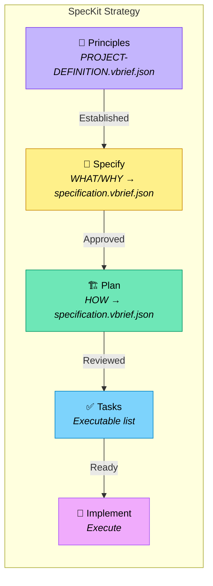

# SpecKit Strategy

A five-phase spec-driven development workflow inspired by [GitHub's spec-kit](https://github.com/github/spec-kit).

Legend (from RFC2119): !=MUST, ~=SHOULD, ≉=SHOULD NOT, ⊗=MUST NOT, ?=MAY.

**⚠️ See also**: [strategies/interview.md](./interview.md) | [strategies/discuss.md](./discuss.md) | [core/glossary.md](../core/glossary.md)

## When to Use

- ~ Large or complex projects with multiple contributors
- ~ Projects requiring formal specification review
- ~ When parallel agent development is planned
- ~ Enterprise environments with compliance requirements
- ? Skip Phase 1 if PROJECT-DEFINITION.vbrief.json Principles narrative already defined

## Workflow Overview



---

## Phase 1: Principles

**Goal:** Establish immutable project principles before any specification.

**Output:** `Principles` narrative in `vbrief/PROJECT-DEFINITION.vbrief.json`

! Before writing output artifacts, follow the [Spec-Generating Guard](./artifact-guards.md#spec-generating-guard-full).

### Process

- ! Define 3-5 non-negotiable principles
- ! Include at least one anti-principle (⊗)
- ! Write principles as the `Principles` narrative in `vbrief/PROJECT-DEFINITION.vbrief.json`
- ~ Interview stakeholders about architectural constraints
- ⊗ Proceed without defined principles
- ⊗ Create a standalone `project.md` -- principles belong in PROJECT-DEFINITION.vbrief.json

### Transition Criteria

- ! `Principles` narrative in `vbrief/PROJECT-DEFINITION.vbrief.json` is complete
- ! All stakeholders have reviewed principles
- ~ No `[NEEDS CLARIFICATION]` markers remain

---

## Phase 2: Specify (WHAT/WHY)

**Goal:** Document WHAT to build and WHY, without implementation details.

**Output:** WHAT/WHY narratives in `vbrief/specification.vbrief.json`

! Before writing output artifacts, follow the [Spec-Generating Guard](./artifact-guards.md#spec-generating-guard-full).

Write the following narrative keys

- `ProblemStatement` -- what problem this solves
- `Goals` -- desired outcomes
- `UserStories` -- user scenarios with priorities (P1, P2, P3) and acceptance scenarios (Given/When/Then)
- `Requirements` -- numbered functional (FR-001) and non-functional (NFR-001) requirements
- `SuccessMetrics` -- measurable success criteria (SC-001)
- `EdgeCases` -- boundary conditions and error handling

### Guidelines

- ! Focus on WHAT users need and WHY
- ! Use `[NEEDS CLARIFICATION: question]` for any ambiguity
- ! Number all requirements (FR-001, NFR-001) for traceability
- ! Prioritize user stories (P1, P2, P3)
- ⊗ Include HOW to implement (no tech stack, APIs, code)
- ⊗ Guess when uncertain -- mark it instead
- ⊗ Create `specs/` directories or standalone `spec.md` files -- all content goes in `vbrief/specification.vbrief.json`

### Transition Criteria

- ! No `[NEEDS CLARIFICATION]` markers remain in narratives
- ! All user stories have acceptance scenarios
- ! Requirements are testable and unambiguous
- ! Stakeholders have approved specification narratives

---

## Phase 3: Plan (HOW)

**Goal:** Document HOW to build it with technical decisions.

**Input:** Approved WHAT/WHY narratives in `vbrief/specification.vbrief.json`

**Output:** HOW narratives enriching `vbrief/specification.vbrief.json`

Add the following narrative keys to `vbrief/specification.vbrief.json` `plan.narratives`:

- `Architecture` -- high-level system design (components, data model, API contracts)
- `TechDecisions` -- technology choices with rationale
- `ImplementationPhases` -- phased delivery plan with dependencies
- `PreImplementationGates` -- simplicity gate, test-first gate

### Guidelines

- ! Reference spec requirements (FR-001, etc.) from Phase 2 narratives
- ! Document rationale for every technology choice
- ! Pass all pre-implementation gates before proceeding
- ⊗ Write implementation code
- ⊗ Create `specs/` directories or standalone `plan.md` files -- all content goes in `vbrief/specification.vbrief.json`

### Post-Phase 3 Transition Gate: Render for Review

! Phase 3 -> Phase 4 is gated on an explicit render-and-review step, mirroring the Phase 2 approval gate. Complete the steps below **in order** before advancing. [skills/deft-directive-setup/SKILL.md](../skills/deft-directive-setup/SKILL.md) is required to invoke `task spec:render` at this boundary when running speckit interactively; the gate fails silently otherwise (yolo-mode agents used to skip it -- that is what this gate exists to prevent).

1. ! Run `task spec:render` to (re-)produce `SPECIFICATION.md` from `vbrief/specification.vbrief.json`.
2. ! Confirm `SPECIFICATION.md` exists at the project root.
3. ! Confirm the hash of `SPECIFICATION.md` matches the hash of the rendered output of `vbrief/specification.vbrief.json` narratives -- re-run `task spec:render` if the file is out of date. This is the Phase 3 **hash-match transition criterion**.
4. ! `SPECIFICATION.md` is a read-only rendered export for human review. `vbrief/specification.vbrief.json` remains the source of truth -- direct edits to `SPECIFICATION.md` are overwritten by the next render.
5. ! Human reviewer approves the rendered spec (or requests changes). On approval, proceed to Phase 4.

### Transition Criteria

- ! All gates pass (or exceptions documented)
- ! Every spec requirement maps to a plan element
- ! Architecture reviewed and approved
- ! **Phase 3 -> Phase 4 transition criterion:** `SPECIFICATION.md` exists AND its hash matches the rendered output of the current `vbrief/specification.vbrief.json` narratives (run `task spec:render` to refresh; agents MUST NOT advance to Phase 4 without this).

---

## Phase 4: Tasks (Scope vBRIEF Emission)

**Goal:** Emit one scope vBRIEF per implementation phase so downstream tooling (`task roadmap:render`, `task project:render`, swarm allocation) can operate against the lifecycle model described in [vbrief/vbrief.md](../vbrief/vbrief.md).

**Input:** Approved HOW narratives in `vbrief/specification.vbrief.json` (`ImplementationPhases` narrative describes IP-1..IP-N).

**Output:** N scope vBRIEFs in `./vbrief/pending/`, one per implementation phase, using the filename convention `YYYY-MM-DD-ip<NNN>-<slug>.vbrief.json` (NNN = 3-digit zero-padded, 001..N). See [vbrief/vbrief.md — speckit Phase 4 scope vBRIEFs](../vbrief/vbrief.md#speckit-phase-4-scope-vbriefs) for the canonical convention.

### Scope vBRIEF Shape

For each implementation phase IP-N, write a scope vBRIEF with:

- ! `plan.title` — phase title (e.g. "IP-3: Implement data layer")
- ! `plan.status` — `pending`
- ! `plan.narratives.Description` — short human summary of the phase
- ! `plan.narratives.Acceptance` — acceptance criteria copied from the spec
- ! `plan.narratives.Traces` — FR/NFR/IP IDs the phase covers (e.g. `FR-001, FR-003, NFR-002, IP-3`)
- ! `plan.references` — link back to the parent `vbrief/specification.vbrief.json` (`type: x-vbrief/plan`)
- ! `plan.metadata.dependencies` — array of IP IDs this phase depends on / is blocked by (plan-level; mirrors the `edges[].blocks` structure used in earlier drafts)

```json
{
  "vBRIEFInfo": { "version": "0.5" },
  "plan": {
    "title": "IP-3: Implement data layer",
    "status": "pending",
    "narratives": {
      "Description": "Stand up the data layer described in specification.vbrief.json Architecture.",
      "Acceptance": "Repository interfaces defined; CRUD round-trips pass integration tests.",
      "Traces": "FR-001, FR-003, NFR-002, IP-3"
    },
    "metadata": {
      "dependencies": ["ip-1", "ip-2"]
    },
    "references": [
      { "type": "x-vbrief/plan", "url": "../specification.vbrief.json" }
    ],
    "items": []
  }
}
```

### plan.vbrief.json — Session Tracker Only

- ! `plan.vbrief.json` reverts to its canonical session-todo role defined in [vbrief/vbrief.md — plan.vbrief.json](../vbrief/vbrief.md#planvbriefjson). It is the agent-private tactical plan for the current session, not the project-wide IP list.
- ! While working on a specific scope vBRIEF, `plan.vbrief.json` MUST carry a `planRef` to that scope vBRIEF in `vbrief/pending/` or `vbrief/active/`.
- ⊗ Emit the project-wide Phase 4 task list to `plan.vbrief.json` — write per-IP scope vBRIEFs to `vbrief/pending/` instead.

### Migrating Legacy speckit Projects

- ~ Projects that already emitted a speckit-shaped `plan.vbrief.json` (project-wide IP list) can convert to the new model with:
  ```
  python scripts/migrate_vbrief.py --speckit-plan vbrief/plan.vbrief.json
  ```
  The translator emits one scope vBRIEF per IP into `vbrief/pending/` (3-digit padded filenames, bilingual `edges` reader so both `from/to` and legacy `source/target` translate correctly) and writes the remaining session-level scaffold back to `plan.vbrief.json`.

### Guidelines

- ! Derive one scope vBRIEF per implementation phase from `ImplementationPhases`
- ! Populate `Description`, `Acceptance`, and `Traces` narratives per [vbrief/vbrief.md — canonical narrative keys](../vbrief/vbrief.md#scope-vbrief-narrative-keys)
- ! Use `plan.metadata.dependencies` (plan-level) rather than item-level `blocks` edges for cross-scope dependencies
- ~ Size each phase for 1-4 hours of work so the swarm allocator can distribute cleanly
- ⊗ Create phases not traceable to a spec requirement

### Transition Criteria

- ! Every implementation phase from `ImplementationPhases` has a matching scope vBRIEF in `./vbrief/pending/`
- ! Each scope vBRIEF has `Description`, `Acceptance`, and `Traces` narratives
- ! Each scope vBRIEF carries a `references` entry linking back to `vbrief/specification.vbrief.json`
- ! Cross-scope dependencies in `plan.metadata.dependencies` form a valid DAG (no cycles)

---

## Phase 5: Implement

**Goal:** Execute scope vBRIEFs following test-first discipline.

**Input:** Scope vBRIEFs in `./vbrief/pending/` (promote to `./vbrief/active/` via `task scope:activate` when work begins). `./vbrief/plan.vbrief.json` holds the current session's tactical todo list and carries a `planRef` to the active scope.

### Process

- ! Write tests BEFORE implementation (Red)
- ! Implement minimal code to pass tests (Green)
- ! Refactor while keeping tests green (Refactor)
- ! Update scope vBRIEF `plan.status` and folder via `task scope:*` commands as work progresses (`pending` → `running` → `completed`)
- ! Update `./vbrief/plan.vbrief.json` session todos as tactical steps progress (session-scoped; do NOT put the project-wide IP list here)
- ~ Work on scope vBRIEFs whose `plan.metadata.dependencies` are already completed in parallel when possible

### File Creation Order

1. Create contract/API specifications
2. Create test files (contract → integration → unit)
3. Create source files to make tests pass
4. Refactor and document

### Guidelines

- ! Follow the `Principles` narrative in `vbrief/PROJECT-DEFINITION.vbrief.json` throughout
- ! Move scope vBRIEFs through lifecycle folders using `task scope:activate|complete|cancel|block|unblock`
- ⊗ Implement without failing tests first
- ⊗ Skip refactoring phase
- ⊗ Write the project-wide IP list to `plan.vbrief.json` — use `vbrief/pending/` scope vBRIEFs as the durable task tracker

---

## Artifacts Summary

| Phase | Artifact | Purpose |
|-------|----------|---------|
| 1. Principles | `vbrief/PROJECT-DEFINITION.vbrief.json` | Governing rules (Principles narrative) |
| 2. Specify | `vbrief/specification.vbrief.json` | WHAT/WHY narratives |
| 3. Plan | `vbrief/specification.vbrief.json` | HOW narratives (enriches Phase 2) |
| 3b. Render SPECIFICATION | `SPECIFICATION.md` (rendered via `task spec:render`) | Read-only human review export |
| 3c. Render PRD | `PRD.md` (rendered via `task prd:render`) | Optional stakeholder-review export |
| 4. Tasks | `./vbrief/pending/YYYY-MM-DD-ip<NNN>-<slug>.vbrief.json` (one per IP) | Scope vBRIEFs drive roadmap/project render + swarm |
| 4b. Session todos | `./vbrief/plan.vbrief.json` | Session-level tactical plan (carries `planRef` to active scope) |
| 5. Implement | Code + tests | Working software |

## Directory Structure

```
project/
├── vbrief/
│   ├── PROJECT-DEFINITION.vbrief.json  # Phase 1: Principles narrative
│   ├── specification.vbrief.json       # Phase 2+3: WHAT/WHY + HOW narratives
│   ├── plan.vbrief.json                # Phase 4b: session todos (planRef to active scope)
│   └── pending/                        # Phase 4: IP-level scope vBRIEFs
│       └── YYYY-MM-DD-ip001-….vbrief.json
├── SPECIFICATION.md                    # Rendered export (task spec:render)
├── PRD.md                              # Optional rendered export (task prd:render)
└── src/                                # Phase 5
```

## Invoking This Strategy

Set in PROJECT-DEFINITION.vbrief.json narratives:
```json
"Strategy": "strategies/speckit.md"
```

Or explicitly:
```
Use the speckit strategy for this project.
```

Start with:
```
I want to build [project] with features:
1. [feature]
2. [feature]
```
